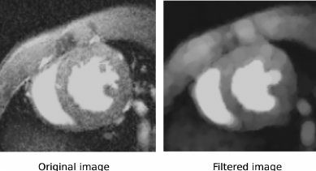
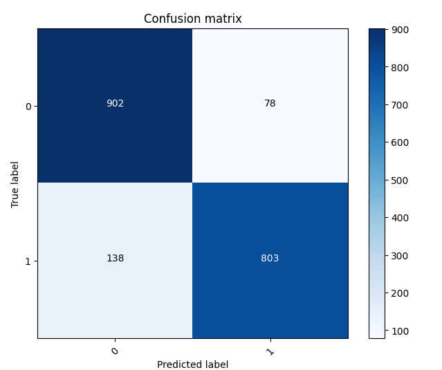
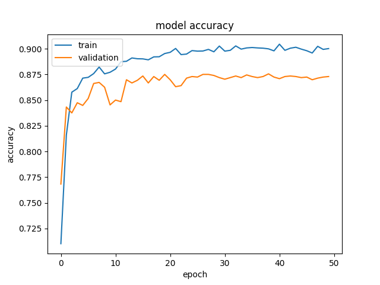

# Curing Cancer with Code
*Correction: using a convoluted neural network to identify skin lesions as benign or malignant (cancerous or non-cancerous)*

## Usage

```
dataset/
  train/
  test/
LICENSE.txt
README.md
classification.py
model.h5
requirements.txt
```
1. Clone the repository with `git clone https://github.com/lachlanharrisdev/skin-cancer-classification.git`
2. Navigate to project directory `cd skin-cancer-classification`
3. Install requirements from file `pip install -r requirements.txt`
4. Usage:
   Train the model and save as a  `.h5` file with `python3 classification.py`   
---
## Introduction
*TAKEN FROM MY PERSONAL WEBSITE; READ THE PROPERLY FORMATTED VERSION [HERE](https://www.lachlanharris.dev/blog/skin-cancer-ai). THIS PROJECT IS NOT COMPLETE, NEITHER IS THIS README*

Skin cancer is the third most common form of cancer<sup>[[1](https://www.canceraustralia.gov.au/cancer-types/melanoma-skin/melanoma-skin-statistics)]</sup> in the land down under, with hundreds of deaths likely stemming from our culture of "she'll be right" when it comes to sun safety. Skin cancer, for a very long time, has been diagnosed visually, but involves a convoluted process of clinical screenings, dermoscopic analysis, biopsies & histopathological examinations.

What really struck me was the fact that melanoma, if caught early on, is almost totally curable<sup>[[2](https://www.cancer.org.au/about-us/policy-and-advocacy/prevention/uv-radiation/related-resources/early-detection)]</sup>. Yet so many people don't take enough care in looking after their body or at least watching for any abnormal skin lesions.

Even worse, what if people are concerned about all of the tests they'd have to do which could be for nothing, and put off going to a GP? The months, weeks, even days that this process is delayed could be the difference between them thriving, surviving, or even dying.

## Goals

This isn't meant to be some corporate money-stealing algorithm that will help me escape the matrix. This is a relatively small-scale project that acts as a demo for what the future of treating cancer could involve. I aim to make all of the code free and public, so that an individual smarter than me can improve it and hopefully save lives.

If the hours of work I've put into making this app save just one life, then that is so much more important than any amount of money.

The algorithm used will be a CNN, or Convolutional Neural network. This is a more advanced type of neural network, that has at least 1 layer dedicated to convolution (where the neuron / unit recieves input from multiple inputs of the previous layer which combine to create a proximity). These are known to be excellent when handling image-based networks.

*Hold on,* you don't know what I'm talking about? Neurons? Layers? If you want a good idea of some of the concepts I'll talk about, [Take a look at this video by 3Blue1Brown](https://www.youtube.com/watch?v=aircAruvnKk) which covers all the basics of neural networks.

What the main goal of this network will be is to simply take in an image, feed it through the neural network, and return whether the image contains a *benign* or *malignant* skin lesion. Simple enough, right?

```
Image → Neural network → ["Benign", "Malignant"]
```

Wrong. Oh so very wrong. The process just to train the model alone felt like doing a backflip on a crocodile while balancing a bright red ball on your nose.

## Part 1: Training wheels

The majority of the time spent creating a neural network is simply training it. I like to think of it like raising a child: watching it slowly become smarter and more mature, having those moments like "Yes! They can finally do that!", and then changing their diapers after you realise every advancement is just a fluke.

### The Dataset

This was probably the easiest aspect of training. There are many public access datsets online, each with very different ways of representing data. The [International Skin Imaging Collaboration](https://www.isic-archive.com/) would be the most official source of data for a test like this, however I found a [Kaggle dataset](https://www.kaggle.com/datasets/fanconic/skin-cancer-malignant-vs-benign) which has organised the data already into over **3000** 224px by 244px close-up photographs of various different types of skin cancer, sorted as either malignant or benign (the only categories we are concerned about).

I did originally intend to identify the *type* of skin cancer as well, however public datasets were less reliable, and the CNN would've had to have *many* more layers to be able to pick up the subtle differences between the many different types.

### Data Preparation

If you watched that 3Blue1Brown video from before, you probably noticed that neural networks are only really equipped to handle numbers. So how the hell do we force-feed it an image? That's like passing a tessaract through the square hole in a children's toy.

That's where the "Convolutional" part of the Convolutional Neural Network comes in to play.

If every pixel of an image is passed into a neural network (and taking numbers from the dataset, each image is 224x244), with each pixel having three different colour channels (R,G,B) then the input layer alone would be $224 \cdot 244 \cdot 3 = 163 968$

But what convolutional neural networks do is break down an image using **filters** (AKA kernels) to scan smaller chunks of an image. The convolutional layers then combine these kernels into simplified representations of the original image that still preserve a lot of the detail.

#### ... But we're not done

Take a look at this photo:

(IMAGE)

You might be able to see that there is some lesion on the skin here. Simple enough, right? What a computer would see is very different. Every single one of those hairs could be confused to be the salience, and can add unnecessary noise to the photo. The porous texture of one's skin also has a very similar effect, and can disrupt the search for patterns within an image. And let's not forget about the actual noise in the photo, a natural byproduct of the way cameras work.

Computers thrive when what it's analysing is clearly separated from other data and has as little noise as possible. So, we need to filter out some of that noise.

One method of doing this is through morphological filtering, which smooths out the noise based on a greyscale version of an image.


*Example of what morphological filtering does*

I won't get deep into it, but it then uses a unique edge-detection algorithm called "Blackhat" which assigns a higher brightness to pixels that vary the most from their neighbours, and the morphological filter uses this information to colourise those pixels according to the colour of their neighbours, resulting in a much smoother image that only captures the main details. This is what the final result looks like.

(IMAGE)

#### ... And we're still not done

... But we're nearly there. All of this works in theory, where these photographs are taken in a professional environment with the same type of camera, FOV, distance & light levels, but if a model like this is meant to be used by the public on phone cameras, then the model needs to learn to adapt to the wild conditions of a less controlled environment.

The best way to do this is to apply random transformations to images, such as rotating them, resizing them, upping or lowering the brightness & contrast by a random amount, and even flipping the images randomly.

This prevents the model from picking up subtle patterns that rely in the way photos are captured in the training data, and instead makes it rely on actual patterns with the lesions.

## Part 2: Trial by Fire

On my laptop, the AI took about 50 minutes to train, which I am very happy with considering the results.

The model is trained on thousands of different images from the public archive on Kaggle, as I said before, but the archive also included in separate folders 1000 images to "test" with. These are images that are similar to the ones in the training data, however aren't used within it, which gives a perfect chance to trial our model.

When the model is built, it is then fed these images and classifies them into the two categories. At the end, it tallies up how many it got right or wrong into a confusion matrix. This is the result:


*1 represents a benign, 0 represents a malignant*

Additionally, as the AI is learning, it tests it's accuracy every epoch against the training data, and here is just how quickly the model learnt:


*Accuracy is a decimal between 0-1, representing the fraction of correct to incorrect estimations. Validation is testing the neural network against our smaller sample of testing images, rather than the training data.*

We can see that the AI has an accuracy of ~90%, but what I was quite surprised by is the fact that it has a much higher rate of false positives than false negatives, which is actually a great way to counter the guranteed inaccuracy in a model like this.

## Part 3: What I've Learnt

This has been an exhilarating project to built. I've learnt so much about the more advanced parts of neural networks (mainly image classification) and just how smart AI can be, so long as you have enough patience to train a model for many, many hours.

What I'm so happy about is that this was a project I made over a weekend, as a bored teenager who's basketball season just ended. If this project gains traction, then there could genuinely be a chance that this app saves lives. Or, if a company sees this project, and with a budget >$0 creates an app that greatly improves the convenience and accuracy, could save many more lives than I ever dreamt of this one.

If you've made it this far, I'm really hoping you can continue on this project, and whether you credit me or not, I hope you can make your impact with technology like this.

Thanks for reading, kind stranger :)
